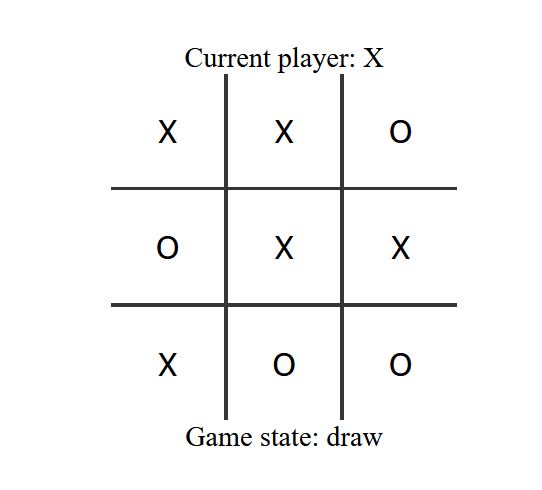

# tic-tac-toe Managed Component


This managed component embeds an application into a webpage which enables a tic-tac-toe game to be played against a remote opponent.

| | |
|-|-|
|||

## Architecture


Note: This component requires a [component manager](https://webcm.dev/) in order to work as intended.

## Events

`pageview` - used to print some debug information

> That's it; the component primarily loads assets and makes POST calls against the backend.

## Local development

**Build this project**

```bash
npm install
npm run build
```

**Setup WebCM proxy**

1. Create separate directory (outside of this one)
1. Copy the [example webCM config](./local/example.webcm.config.ts) to that directory
1. Create a symlink to this directory in a `components` directory 
1. Run WebCM `npx webcm` (needs Node v18 specifically)

Example steps: _Double check them before running them and run them one at a time!_
```bash
mkdir -p ../tic-tac-toe-webcm/components
cp local/example.webcm.config.ts ../tic-tac-toe-webcm/webcm.config.ts
ln -s ./ ../tic-tac-toe-webcm/components/tic-tac-toe
cd ../tic-tac-toe-webcm/components
npx webcm
```

**Host a site**

In a separate process, launch a local site on port `8000` (see the port configured in).

Example using python to serve an empty site:
```bash
cd local
python3 -m 'http.server' 8000
```

**Navigate to your site**

https://localhost:1337


**Make changes**

To make change to the UX see [index-ux.tsx](./src/index-ux.tsx).

To configure the managed component see [index.tsx](./src/index.tsx).

You need to rebuild this managed component, and to re-launch webCM after every change.

## Making changes to the worker

See this project to make changes to the backend.

## Challenges working with managed-components

List of issues encountered when building this from scratch when following documentation for [MC](https://managedcomponents.dev/getting-started/quickstart) and [WebCM](https://webcm.dev/getting-started/intro).

 - `npx webcm` does not work with node >= 19 (tries to set a value on a read-only object)
 - `npm init managed-widget` does not work out of the box
    - `esbuild.js` missing
    - `tsconfig.ts` and `tsconfig.build.ts` missing
    - eslint config not initialized (build fails)
 - `npm init managed-widget` UX
    - the confirmation at the end of the wizard is easy to auto-accept and it throws away the full wizard 
 -  https://managedcomponents.dev/specs/embed-and-widgets/widgets is out of date. Needs to return the string append to the doc, not call render on the element.
 - development cycle between webcm & managed component is slow (need to manually rebuild MC and then relaunch webCM)
 - unclear what development layout should be; looks like there's lots of different projects that each have their own dependencies to make a single widget work.
 - response built from `https://managedcomponents.dev/specs/server-functionality/route` is incorrect
 - sending a POST message through `manager.proxy` results in 504

Personal challenges:
 - needed to ramp up on tooling I was unfamiliar with or hadn't touched in a while
    - cloudflare workers
    - managed components
    - webcm
    - esbuild
    - vite
